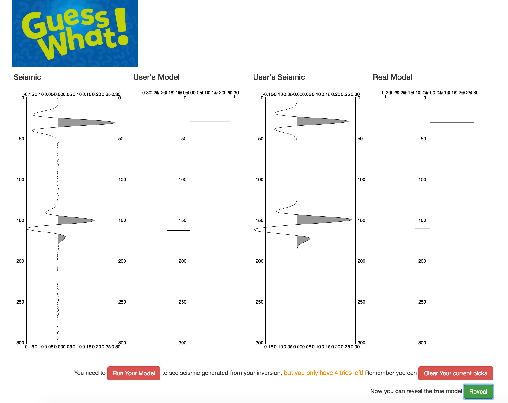

# Human Inversion (Guess What)

This app was built during the [Geo Gaming Hackathon](http://www.agilegeoscience.com/blog/2016/2/16/a-european-hackathon) ahead of teh EAGE 2016 in Vienna.
The idea was to challenge users to invert the seimsic trace by guessing the underlying geology that generated it.

During the hackathon we build something that approaches Human Inversion which we've called Guess What? It allows you to play 4 fixed levels, which we'd like 
to think of as training levels, that you'd do before starting the harder levels.

## Screenshot

## Ideas
We have various ideas for extending the app:

 1. Tweet your scores, and joina leaderboard
 1. Challenge a friend
 1. Better scoring and scores per turn
 1. Pick impedance profiles instead of reflectivity
 1. Base challenges on real log data
 1. Compare user results to an impednance inversion
 1. ...

## Flask
The app uses a small flask server to provide a few endpoints, so its also quite a good starting example of how to get some python codes served up as RESTish API endpoints serving back json.

## Contributors
 - Carlos Martin
 - Henrique Bueno de los Santos
 - Steve Purves

## Starting the server
Once you have a scientific python environment available, in the root folder type
    python server.py
    